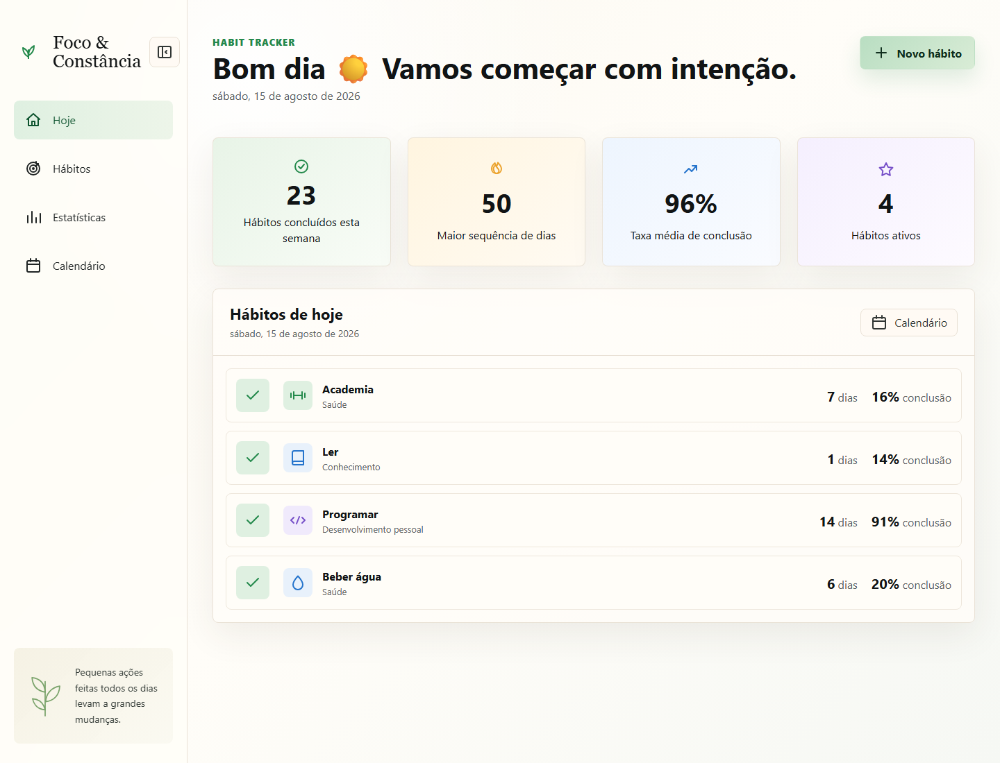
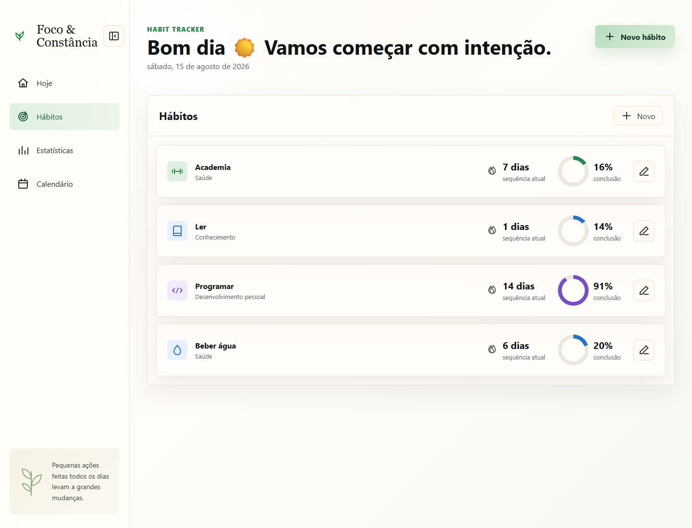
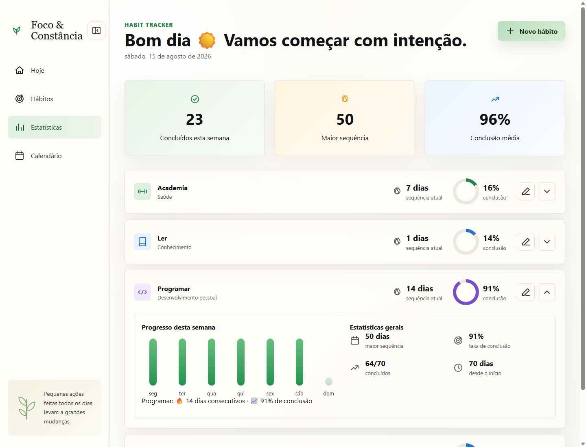
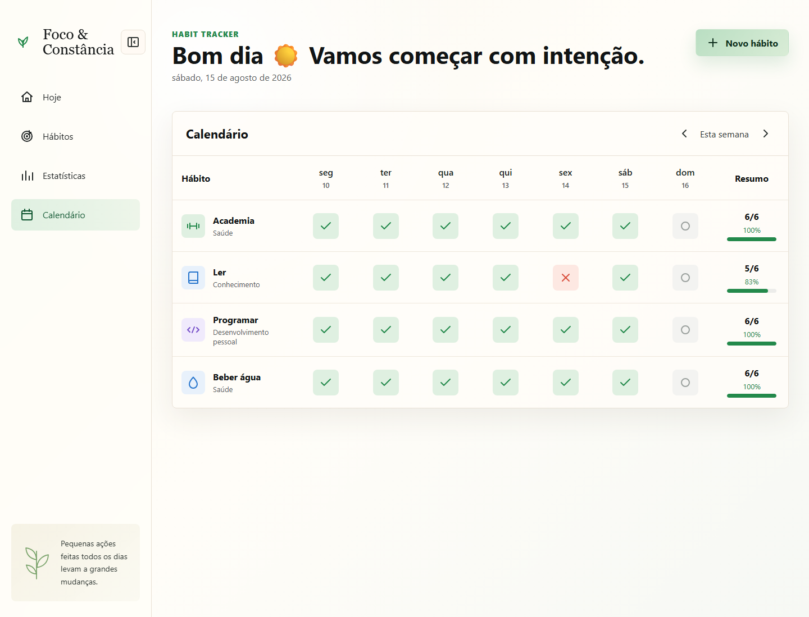

# 🌱 Habit Tracker

> Aplicação web para acompanhar hábitos diários, registrar progresso e visualizar métricas de constância.

<div align="center">

[](https://habit-tracker-kappa-sooty.vercel.app/)


</div>

---

## 📖 Sobre o projeto

O **Habit Tracker** é uma aplicação web estática desenvolvida para facilitar o acompanhamento de hábitos e ajudar na construção de uma rotina mais consistente.

A aplicação permite criar hábitos personalizados, definir categorias e cores, registrar diariamente a conclusão das atividades e acompanhar o desempenho por meio de estatísticas e visualizações semanais.

O projeto possui uma interface focada em produtividade, com navegação por diferentes áreas do aplicativo e persistência dos dados diretamente no navegador.

---

## 🌐 Acesse o projeto

### 🚀 [Abrir Habit Tracker](https://habit-tracker-kappa-sooty.vercel.app/)

O projeto está hospedado na **Vercel** e pode ser utilizado diretamente pelo navegador.

---

## ✨ Funcionalidades

### 📝 Cadastro de hábitos

Permite criar novos hábitos informando:

- Nome do hábito
- Categoria
- Cor

Os hábitos cadastrados ficam disponíveis para acompanhamento diário.

---

### ✅ Registro diário

Cada hábito pode ser marcado como concluído diretamente pela aplicação.

O registro permite acompanhar quais atividades foram realizadas durante a semana.

---

### 📊 Dashboard

A tela inicial apresenta um resumo da rotina e dos hábitos do dia.

A partir dela é possível visualizar rapidamente o progresso atual e registrar a conclusão das atividades.



---

### 📋 Gerenciamento de hábitos

A área de hábitos apresenta os hábitos cadastrados e permite acompanhar as atividades que fazem parte da rotina.



---

### 📈 Estatísticas

O aplicativo possui uma área dedicada ao acompanhamento do desempenho.

Entre as informações apresentadas estão:

- Sequência atual
- Taxa de conclusão
- Progresso semanal
- Métricas de constância



---

### 📅 Calendário

A visualização de calendário permite acompanhar o histórico semanal dos hábitos.

Essa visualização facilita identificar os dias em que cada hábito foi concluído.



---

### 🧭 Navegação

O aplicativo possui uma navegação organizada por diferentes áreas:

- Dashboard
- Hábitos
- Estatísticas
- Calendário

A sidebar também pode ser recolhida para ampliar o espaço disponível para o conteúdo.

---

### 🌅 Saudação dinâmica

A interface apresenta uma saudação de acordo com o horário atual:

- Bom dia ☀️
- Boa tarde 🍃
- Boa noite 🌙

---

### 💾 Persistência local

Os dados são armazenados utilizando `localStorage`.

Isso permite manter os hábitos e seus registros no navegador mesmo após atualizar ou fechar a aplicação.

> Os dados permanecem armazenados localmente e não são sincronizados com um servidor.

---

## 🧠 Funcionamento

O fluxo principal da aplicação pode ser representado da seguinte forma:

```text
                  ┌─────────────────┐
                  │      Usuário    │
                  └────────┬────────┘
                           │
                           ▼
                  ┌─────────────────┐
                  │ Criar um hábito │
                  └────────┬────────┘
                           │
                    ┌──────┼──────┐
                    ▼      ▼      ▼
                  Nome  Categoria  Cor
                    │
                    ▼
              ┌───────────────┐
              │ Hábito criado │
              └───────┬───────┘
                      │
                      ▼
              ┌───────────────┐
              │ Registro diário│
              └───────┬───────┘
                      │
                      ▼
              ┌───────────────┐
              │   Estatísticas│
              └───────┬───────┘
                      │
             ┌────────┼────────┐
             ▼        ▼        ▼
          Sequência  Taxa    Progresso
                    conclusão semanal
                      │
                      ▼
              ┌───────────────┐
              │  LocalStorage │
              └───────────────┘
```
🛠️ Tecnologias
HTML5 — estrutura da aplicação
CSS3 — estilização, layout e responsividade
JavaScript Vanilla — lógica e interações
LocalStorage — persistência dos dados no navegador
Vercel — hospedagem e deploy
```
Habit-Tracker/
│
├── screenshots/
│   ├── calendar-demo.png
│   ├── habits-demo.png
│   ├── home-demo.png
│   └── stats-demo.png
│
├── app.js
├── favicon.svg
├── index.html
├── styles.css
└── README.md
```

Principais arquivos
Arquivo	Descrição
index.html	Estrutura principal da aplicação
styles.css	Estilos, layout e responsividade
app.js	Lógica dos hábitos, navegação, métricas e persistência
favicon.svg	Ícone da aplicação
README.md	Documentação do projeto

Como executar localmente

O projeto utiliza apenas tecnologias web nativas e não exige instalação de dependências.

1. Clone o repositório
git clone https://github.com/EmanuelFHX/Habit-Tracker.git
2. Acesse a pasta
cd Habit-Tracker
3. Execute

Abra o arquivo index.html diretamente no navegador.

Também é possível utilizar uma extensão como Live Server no VS Code.

🔒 Armazenamento dos dados

O Habit Tracker utiliza o localStorage do navegador para armazenar os dados da aplicação.

Aplicação
    │
    ▼
Dados dos hábitos
    │
    ▼
localStorage
    │
    ▼
Navegador do usuário

Não existe banco de dados ou backend para sincronização dos hábitos.

Isso mantém a aplicação simples e permite que ela funcione como uma aplicação web estática.

🎯 Objetivos do projeto

O projeto foi desenvolvido com dois objetivos principais:

Para o usuário

Oferecer uma ferramenta simples e visual para acompanhar hábitos e melhorar a consistência da rotina.

Para desenvolvimento

Praticar conceitos de desenvolvimento front-end utilizando tecnologias web nativas, incluindo:

Manipulação do DOM
JavaScript Vanilla
Eventos e interações
Gerenciamento de estado
Persistência com localStorage
Cálculo de métricas
Navegação entre telas
Design responsivo
Organização de interfaces
🚧 Possíveis melhorias

Algumas funcionalidades que podem ser adicionadas futuramente:

 Metas diárias e semanais
 Sequência máxima de hábitos
 Estatísticas mensais
 Gráficos de evolução
 Sistema de conquistas
 Notificações
 Exportação dos dados
 Backup e restauração
 Temas personalizados
 Sincronização em nuvem
 Autenticação de usuários
 Aplicativo mobile
📈 Status

🟢 Em funcionamento

O Habit Tracker está disponível online e pode ser utilizado diretamente pelo navegador.


👨‍💻 Autor
Emanuel Penna
